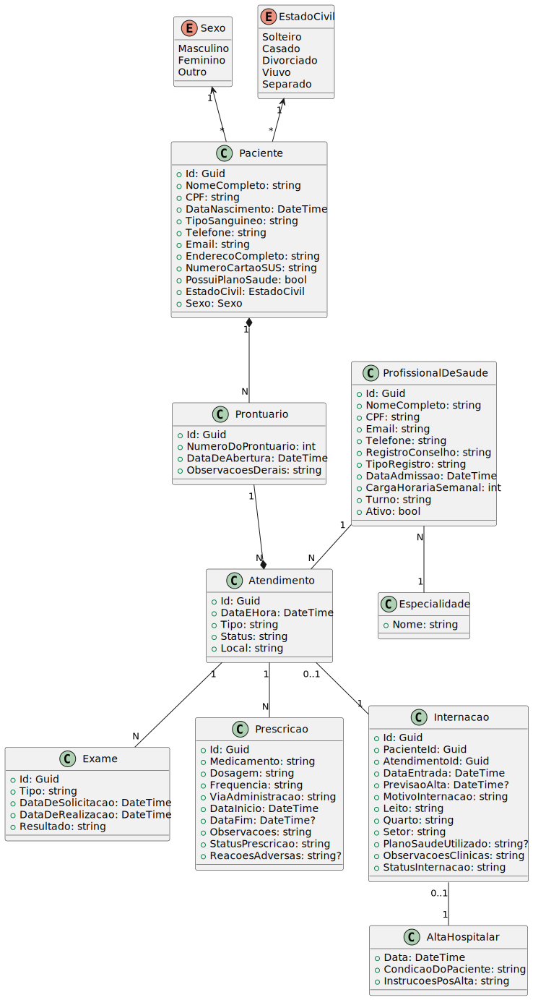

# HOSPISIM-TP3

## Descrição
Esse é o meu projeto de avaliação A2 de Topicos em Programação 3 com o seguinte tema .
HOSPISIM é um sistema de gestão clínica desenvolvido para o **Hospital Vida Plena** com o objetivo de modernizar a gestão hospitalar. O sistema oferece controle completo de informações dos pacientes, segurança nos atendimentos e rastreabilidade das ações médicas realizadas. 

O HOSPISIM-TP3 é baseado em **.NET Core (8)** utilizando o **MVC (Model-View-Controller)** com **Entity Framework** para a interação com o banco de dados **SQL Server**
## Tecnologias

- **.NET Core 8** (MVC) - Framework utilizado para a construção do sistema.
- **Entity Framework** - ORM (Object-Relational Mapping) para interação com o banco de dados.
- **SQL Server** - Banco de dados utilizado para armazenar as informações dos pacientes e atendimentos.

## Instruções

1. **Clone o repositório**
    ```bash
     git clone https://github.com/seu-usuario/HOSPISIM-TP3.git
    ```
    
2. **Configuração do banco de dados**
    No SQL Server Manager crie a DataBase
    - HOSPISIMDb

    Dentro de **appsettings.json** mude a connection string para conectar na sua maquina
    ```bash
     "ConnectionStrings": {
      "Default": "Data Source=(Sua-Maquina)\\SQLEXPRESS;Initial Catalog=HOSPISIMDb;Integrated Security=True;    Encrypt=False"}
    ```

3. **Configuração do banco de dados**
    Execute no terminal NuGet
    ```bash
     Add-Migration name
    ```
    depois
    ```bash
    Update-Database
    ```

4 **Configuração do banco de dados**
    - Execute o projeto

## Diagrama de Entidades e Relacionamentos

